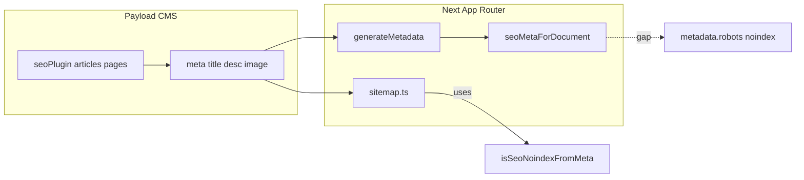

# Payload SEO 实现 vs SEO Skills 维度 — 遗漏核对

## Skills 视角（抽象成检查清单）

- **[technical-seo-checker](.agents/skills/technical-seo-checker/SKILL.md)**：爬虫/索引、robots、sitemap、canonical、国际化（hreflang）、结构化数据、HTTPS 等。
- **[on-page-seo-auditor](.agents/skills/on-page-seo-auditor/SKILL.md)**：title/meta、OG、内链与页面级信号等。

以下均针对 **Payload + Next 前端** 的实现，不重复你方流水线里未完成的 GSC/看板等内容（见 [seo_流量矩阵_未完成清单.md](.cursor/plans/seo_流量矩阵_未完成清单.md)）。

---

## 已覆盖（可视为「未遗漏」的主干）

| 维度 | 现状 |
|------|------|
| CMS 侧 SEO 字段 | [`seoPlugin`](src/payload.config.ts) 挂在 **`articles`、`pages`**，含 `generateTitle` / `generateDescription` / `generateImage` / `generateURL`；`meta` 子字段通过 migration 与类型对齐。 |
| 前端元数据 | 文章 [`posts/[slug]/page.tsx`](src/app/[locale]/(frontend)/posts/[slug]/page.tsx)、CMS 页 [`cmsStaticPageRoute.tsx`](src/app/[locale]/(frontend)/_lib/cmsStaticPageRoute.tsx) 等使用 [`seoMetaForDocument`](src/utilities/seoDocumentMeta.ts)：canonical、hreflang（`alternates.languages`）、基础 Open Graph。 |
| Sitemap / robots | [`src/app/sitemap.ts`](src/app/sitemap.ts)：多租户 + 发布态 + **hreflang alternates**；对 `meta` 做 **noindex 排除**（[`isSeoNoindexFromMeta`](src/utilities/sitemapHelpers.ts)）。[`src/app/robots.ts`](src/app/robots.ts)：disallow admin/api/portal；非 `active` 站点全站 disallow；声明 sitemap URL。 |
| 结构化数据（局部） | 文章页有 [`blogPostingJsonLdString`](src/components/blog/blogPostingJsonLd.ts)（`BlogPosting` + 可选 `Person` author）。 |

---

## 相对 Skills 与内部计划仍算「遗漏」或薄弱点

### 1. noindex：sitemap 与 `<meta name="robots">` 可能不一致（高优先级）

- Sitemap 已用 `isSeoNoindexFromMeta` **过滤** URL。
- [`seoMetaForDocument`](src/utilities/seoDocumentMeta.ts) **未**根据同一规则设置 Next.js `metadata.robots`（无 `noindex, nofollow` 等）。
- 当前 [`Article.meta`](src/payload-types.ts) 类型里也只有 `title` / `description` / `image`，**无** `noIndex` 字段；`isSeoNoindexFromMeta` 注释为「plugin / future」——若后续接入 plugin 的 noindex 或自定义字段，**必须在 `generateMetadata` 与 sitemap 共用同一逻辑**，否则会出现「不进 sitemap 但仍可被抓取索引」或反向不一致。

### 2. On-page / meta-tags 常见项在 `seoMetaForDocument` 中缺失

- **无 Twitter Card**（`twitter: { card, title, description, images }`）。
- **Open Graph 较简**：文章未设 `openGraph.type: 'article'`、`publishedTime` / `modifiedTime` 等（对分享与部分解析器更友好）。
- 根布局 [`(frontend)/layout.tsx`](src/app/[locale]/(frontend)/layout.tsx) 的 `generateMetadata` 未设 Next 推荐的 **`metadataBase`**；若未来 OG 图用相对路径，解析会弱于显式 `metadataBase`（当前 meta 图多为绝对 URL 时可降级为改进项）。

### 3. plugin-seo 覆盖范围：产品与分类未纳入

- `seoPlugin` **仅** `articles`、`pages`。
- [`product/[asin]/page.tsx`](src/app/[locale]/(frontend)/product/[asin]/page.tsx) 为手写 metadata：有 canonical 与极简 OG，**无** CMS 统一 `meta`、无完整 OG 图/描述链路。
- **分类页**用 `seoMetaForDocument(category, …)`，但 Category 是否在 Admin 有与 Articles 同级的 SEO 组需与集合定义核对；无论如何，**Offers/ASIN 详情**不在 plugin-seo 内，矩阵站点的「商品着陆」SEO 与文章侧不对称。

### 4. 结构化数据深度 vs schema-markup-generator / EEAT 计划

- 文章 JSON-LD 为 **`BlogPosting`**，非计划文档中有时写的 `Article`；**无** `reviewedBy`、`@id`、Publisher/WebSite 级联等（与 [未完成清单 — EEAT A](.cursor/plans/seo_流量矩阵_未完成清单.md) 一致：**未验收全路径**）。
- **未使用** `seoPlugin` 的 `generateStructuredData`（若本仓库计划曾写「plugin 注入 Person」——当前实现以 **自定义组件 JSON-LD** 为主，与 plugin 高级能力未对齐）。
- 全站 **BreadcrumbList**、站内重要模板的 JSON-LD 仍在清单中列为待验收（内链补丁 J 等）。

### 5. 技术 SEO 周边（非 Payload 专属但 skills 会问）

- 仓库内 **未发现 RSS/Atom feed** 路由（可选，非必错）。
- **RSS 与 GSC/流水线**类项已在 `seo_流量矩阵_未完成清单.md` 单独列出，不重复为「Payload 遗漏」。

---

## 建议优先级（实施时可单独开任务）

1. **统一 noindex**：扩展 `seoMetaForDocument`（或调用方）读取与 `isSeoNoindexFromMeta` 相同的规则，输出 `robots`；必要时在 Payload `meta` 上显式加字段并迁移 + `generate:types`。
2. **补齐社交与文章 OG**：Twitter Card + 文章 `openGraph.type: 'article'` 与时间字段。
3. **评估是否将 `offers` 或 ASIN 路由纳入 seoPlugin**（或独立 `meta` 组 + 同一 `seoMetaForDocument` 封装），避免商品页与文章页 SEO 能力差距过大。
4. **JSON-LD 与 EEAT**：按未完成清单迭代 `blogPostingJsonLd` / 新增 BreadcrumbList，并与 Authors、`reviewedBy` 字段打通后再验收。

