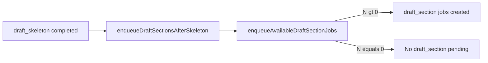

# 为什么只剩框架：`sectionsEnqueued=0` 的含义与排查

## 结论（直接回答「为什么」）

`draft_skeleton` 已成功，但 **`draft_section` 一条都没入队**。流水线在 [`src/app/api/pipeline/tick/route.ts`](src/app/api/pipeline/tick/route.ts) 里把 `enqueueDraftSectionsAfterSkeleton` 的返回值记在横幅上（`sectionsEnqueued=N`）。**N=0 时，后面也就没有按段写作、合并正文**，编辑器里只剩骨架注释是预期现象。

入队逻辑集中在 [`src/app/api/pipeline/lib/articlePipelineChain.ts`](src/app/api/pipeline/lib/articlePipelineChain.ts) 的 `enqueueAvailableDraftSectionJobs`：

- 先 `loadBriefSectionSpecs`（来自 Brief `outline.sections`，否则默认 intro/body/faq/conclusion）。
- 对每个 section：**已在 `successfulDraftSectionIds` 里 → skip**；**该 section 已有 pending/running 的 `draft_section` → skip**；否则用 [`canEnqueueDraftSection`](src/utilities/pipelineSettingShape.ts)（`sectionParallelism`、`sectionParallelWhitelist`、`sectionVariant`）判断是否还能入队。
- **关键**：若某一节判定为 **`gated`**，循环会 **`break`（不是 `continue`）**，本批次后面的小节也不会再尝试入队。

因此 **N=0** 常见几类原因（按代码逻辑，与 [docs/writing-pipeline-chain-debug.md](docs/writing-pipeline-chain-debug.md) 一致）：

1. **`activeBefore`（该文章下仍处于 pending/running 的 `draft_section` 总数）≥ 并行度 cap**  
   - `activeBefore` 来自 `countActiveDraftSectionForArticle`，**按文章汇总**，不是按 section。  
   - 若前面某节已有未完成的 `draft_section`，**第一节被 skip、下一节可能因并行度被 `gated` + `break` → 本轮 `enqueuedCount` 仍为 0**（需要要么先让已有任务被 tick 跑完，要么清理错误卡在 pending 的旧任务）。

2. **所有 outline 小节在「已完成 section」集合里都已存在**  
   - `successfulDraftSectionIds` 统计 `status: completed` 且 `output.ok !== false` 的 `draft_section`，按 `input.sectionId` 去重。历史测试残留会导致「认为都写完了」，从而 0 新入队。

3. **`articleId` / `briefId` 无法解析成数字**  
   - `enqueueDraftSectionsAfterSkeleton` 会直接 return 0 并打 warn：`[chain] enqueueDraftSectionsAfterSkeleton skipped: article/brief id non-numeric`（你截图里 `briefId=1`、article 有数字 id 时可能性较低）。

4. **Brief 无可用小节定义（极少见）**  
   - `specsCount` 为 0 时整轮不会创建任务；服务端会有 `[chain] enqueueAvailableDraftSectionJobs start` 且 `specsCount: 0`。

5. **本地 D1 / SQLite `SQLITE_BUSY`（数据库繁忙）**  
   - 你提供的 workerd 日志：`database is locked: SQLITE_BUSY`，说明同一时刻多个写事务在争用本地 SQLite（例如 admin 页并行请求、`pnpm dev` 下多接口同时写 `workflow-jobs`）。  
   - **与被的现象的关系**：入队 `draft_section` 需要多次 `payload.find` / `payload.create`；若在链式步骤中某次写失败或被中断，可能出现「骨架已更新、section 任务未落地」或 UI 与 DB 短暂不一致。若随后横幅仍显示 `sectionsEnqueued=0`，应回看同一时刻是否伴有 busy 错误、`[pipeline/tick] chained pipeline enqueue failed` 等日志。  
   - **缓解（运维向）**：拉长 run-next 间隔、少开几个会触发写入的标签页、确认没有第二个进程握着同一 `.sqlite`；代码侧仓库已有 [`src/utilities/sqliteBusyRetry.ts`](src/utilities/sqliteBusyRetry.ts)，但并非所有 Payload 调用都包一层 retry。

横幅里 **`tick: no pending job in constraint set`** 表示：本次「勾选 id / 范围」限定的 **约束集内** 没有 pending 了；若同时又 **`sectionsEnqueued=0`**，说明 **链式入队没产生新的 pending id**，所以 run-next 自然停止——这与「只有框架」是同一事实的两面。

## 建议你本地怎么确认（只读排查）

1. **看服务端日志**（同一时刻 job #16）：搜索  
   - `[chain] enqueueAvailableDraftSectionJobs start` → 看 `specsCount`、`doneCount`、`activeBefore`、`whitelist`、`sectionParallelism`。  
   - `[chain] draft_section enqueue decision` → `decision` 是 `done` / `pending_or_running` / `gated` / `enqueued` 中的哪一种。

2. **打开「工作流任务列表」**（横幅按钮）：对 **article #1** 查是否存在  
   - `jobType: draft_section`，状态 `pending` / `running` / `failed`；  
   - 是否有多条历史 `draft_section` 已 `completed` 但正文仍空（配置与执行结果不一致时再结合 `output` 看）。

3. 若确认是 **卡住 pending + 并行度**：先让 **不受约束的全局 tick** 或扩大 seed 范围跑掉已有 `draft_section`，或处理失败任务，再重新触发骨架后链路。

## 若需代码/产品层修复（确认方案后再做）

- **`break` → `continue`（遇 `gated` 时）**：会改变「本批最多入队到并行上限」的语义，可能允许跳过前排拥挤、给后排入队；需产品确认是否与「非白名单段落必须单独跑」等规则冲突。  
- **或在 UI/文档中明确**：`sectionsEnqueued=0` 时必须看 `activeBefore` / workflow 列表，避免误以为「一键跑通」失败。

本次你问的是原因与排查路径，**未改代码**；若你希望默认在遇到 `gated` 时仍 enqueue 其它小节或自动扩展 run-next 约束集，可在确认期望行为后单开实现任务。
