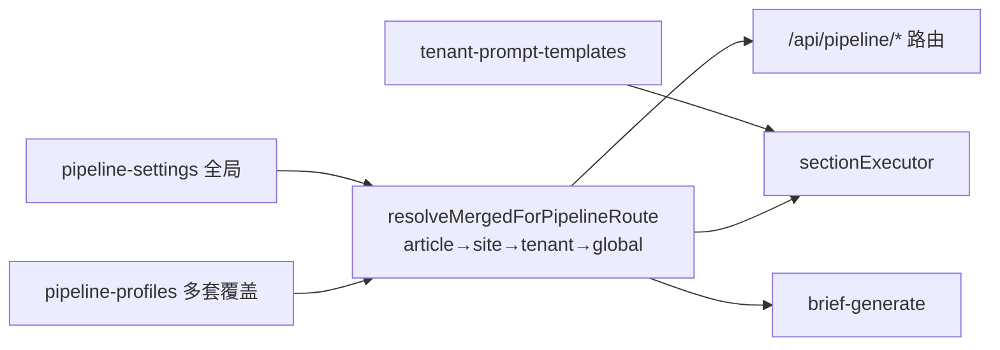
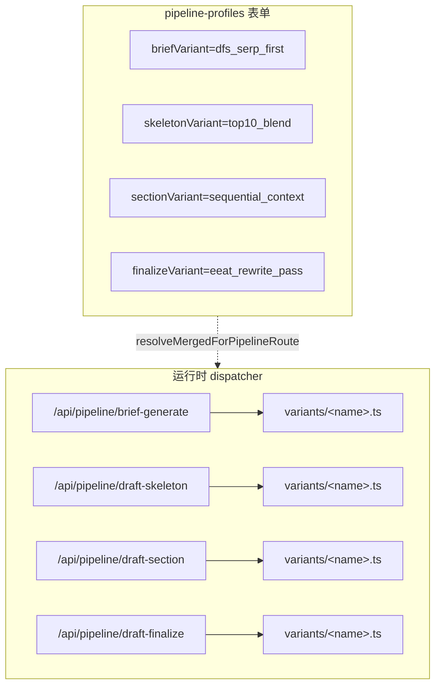

# SEO 文章写作工作流：T2 变体架构 + 效果回溯 + 流程化

## 现状定位



- 已具备：[`PipelineProfiles.ts`](src/collections/PipelineProfiles.ts)、[`TenantPromptTemplates.ts`](src/collections/TenantPromptTemplates.ts)、[`Sites.ts:91`](src/collections/Sites.ts) / [`articleSeoFields.ts:87`](src/collections/shared/articleSeoFields.ts) 的 `pipelineProfile` FK、[`seoTheoryPipelineProfilePresets.ts`](src/utilities/seoTheoryPipelineProfilePresets.ts) 两套预设。
- 但目前是 **T1 参数覆盖**：所有 profile 走同一条骨架 `brief → skeleton → section ×N → finalize → image`（[`articlePipelineChain.ts`](src/app/api/pipeline/lib/articlePipelineChain.ts)），profile 只能换"参数"，不能换"打法"。
- **本计划核心：升级到 T2**——每个阶段挂 2–3 个变体，profile 决定挑哪个，骨架不变。

---

## 阶段 1 · T2 变体架构（核心机制）



### 1A. Shape 与字段（最小可用集）

扩展 [`PipelineSettingShape`](src/utilities/pipelineSettingShape.ts):

```ts
export type PipelineSettingShape = {
  ...existing
  briefVariant: 'tavily_only' | 'dfs_serp_first' | 'competitor_mimic'
  briefVariantConfig: unknown
  skeletonVariant: 'single_shot' | 'top10_blend' | 'cluster_driven'
  skeletonVariantConfig: unknown
  sectionVariant: 'sequential_context' | 'parallel_with_summary' | 'research_per_section'
  sectionVariantConfig: unknown
  finalizeVariant: 'simple_merge' | 'eeat_rewrite_pass' | 'fact_check_pass'
  finalizeVariantConfig: unknown
}
```

- 全局默认：`dfs_serp_first / single_shot / sequential_context / simple_merge`（即当前行为）。
- 在 [`mergePipelineProfileOntoGlobal`](src/utilities/pipelineSettingShape.ts#L85) 加 `triStateString` 合并（profile 留空则继承全局）；config 用 `triStateJson`。
- [`PipelineSettings.ts`](src/globals/PipelineSettings.ts) 与 [`PipelineProfiles.ts`](src/collections/PipelineProfiles.ts) 同步加 `select`（带 options）+ `json` 子参数；profile 表单用 conditional `admin.condition` 仅在选中对应变体时显示子参数 JSON。
- 迁移：`src/migrations/2026XXXX_pipeline_variant_fields.ts` 为 `pipeline_settings` / `pipeline_profiles` 增列。

### 1B. Dispatcher 模式（4 个阶段统一）

每个阶段 route 文件结构：

```
src/app/api/pipeline/<stage>/
  route.ts                    # 入口：resolveMergedForPipelineRoute → dispatch
  variants/
    index.ts                  # variant 注册表 + 类型
    <variantName>.ts          # 单个变体实现，导出 runVariant(ctx)
```

`route.ts` 的标准化做法：

```ts
const merged = await resolveMergedForPipelineRoute({ payload, articleId, ... })
const variantName = merged.<stage>Variant
const variant = stageVariants[variantName] ?? stageVariants.default
const result = await variant.run({ payload, merged, job, ...stageCtx })
return Response.json(result)
```

- 每个变体的 `run` 输入与输出 **shape 必须一致**（同一阶段内）——这样 [`articlePipelineChain.ts`](src/app/api/pipeline/lib/articlePipelineChain.ts) 的链式入队逻辑零改动。
- 第一步先把现有逻辑**原样搬进 `<default-name>.ts`**，注册表只放它一个，跑一轮回归（无行为变化）。再开始挂新变体。

---

## 阶段 2 · 实现 4 阶段的初始变体

每个变体都需提供：(a) 实现文件 (b) 默认 prompt（如有）(c) 单测 (d) seed 一份示例 profile 验证组合。

### 2A. Brief 阶段 · 3 个变体（[`brief-generate/route.ts`](src/app/api/pipeline/brief-generate/route.ts)）

- **`tavily_only`**：纯 Tavily research 出 brief，跳过 DFS。最快最省，适合长尾 informational。
- **`dfs_serp_first`**（default = 现状）：DFS SERP top10 + Tavily 深度，用于 commercial。
- **`competitor_mimic`**：DFS 抓 top3 竞品全文（已有 [`competitor-gap`](src/app/api/pipeline/competitor-gap/route.ts) 工具），反推大纲与覆盖词，适合"打竞品"。

每个变体读 `merged.briefVariantConfig` 拿 `serpDepth` / `competitorCount` 等子参数。

### 2B. Skeleton 阶段 · 3 个变体（[`draft-skeleton/route.ts`](src/app/api/pipeline/draft-skeleton/route.ts)）

- **`single_shot`**（default）：一次 LLM 调用生成大纲。
- **`top10_blend`**：把 brief 中 SERP top10 outline 做 union+dedup，作为 LLM 输入"扩写大纲"。
- **`cluster_driven`**：从 [`keywordClusterPipeline.ts`](src/utilities/keywordClusterPipeline.ts) 的 cluster 直接展开（每簇 1 节），适合 pillar / topical authority。

### 2C. Section 阶段 · 3 个变体（[`draft-section/route.ts`](src/app/api/pipeline/draft-section/route.ts) + [`sectionExecutor.ts`](src/services/writing/sectionExecutor.ts)）

- **`sequential_context`**（default）：当前实现——串行，把前节摘要塞 prompt。
- **`parallel_with_summary`**：先并行写所有节（无前文上下文），finalize 阶段再做"粘合"。配合 [`canEnqueueDraftSection`](src/utilities/pipelineSettingShape.ts#L199) 的并行度。
- **`research_per_section`**：每节单独调一次 Tavily/DFS，把 section-specific evidence 注入 prompt（最贵但 EEAT 最高）。

### 2D. Finalize 阶段 · 3 个变体（`draft-finalize`）

- **`simple_merge`**（default）：直接拼接段落 + 注入 TOC/链接。
- **`eeat_rewrite_pass`**：拼接后追加一次 LLM 改写，按 [`pickEeatWeightsForContentType`](src/utilities/pipelineSettingShape.ts#L161) 调权重。
- **`fact_check_pass`**：先抽取事实陈述（数字/引用），让 LLM 标 confidence，必要时调 Tavily 验证；不达标则降级或加 disclaimer。

### 子参数与 prompt 命名约定

- 子参数都收口到 `<stage>VariantConfig: json`（profile 表单 conditional 显示）。
- 新 prompt 命名：`brief_competitor_mimic_system / _user`、`skeleton_top10_blend_system / _user`、`section_research_per_section_system / _user`、`finalize_eeat_rewrite_system / _user`、`finalize_fact_check_system / _user` 等。注册到 [`promptKeys.ts`](src/utilities/domainGeneration/promptKeys.ts)，默认 body 入 [`defaultOpenRouterTenantPromptBodies.ts`](src/utilities/openRouterTenantPrompts/defaultOpenRouterTenantPromptBodies.ts)，走 [`resolveTenantPromptPair`](src/utilities/openRouterTenantPrompts/loadTenantPromptTemplateBody.ts)（保持与 [`sectionExecutor.ts`](src/services/writing/sectionExecutor.ts) 一致风格）。

---

## 阶段 3 · 效果回溯（profile + variant 快照 + KPI）

### 3A. 文章快照（含变体）

[`src/collections/shared/articleSeoFields.ts`](src/collections/shared/articleSeoFields.ts) 现有 `pipelineProfile` 旁加：
- `pipelineProfileSnapshot: json` —— 完整 `merged`（含 4 个 `<stage>Variant` 与 config）；首次 `enqueueAvailableDraftSectionJobs` 时写入，后续不覆盖。
- `pipelineProfileSlug: text` (index)
- `pipelineProfileSource: text`（`explicit | article | site | tenant_default | global_only`）

写入点：[`enqueueAvailableDraftSectionJobs`](src/app/api/pipeline/lib/articlePipelineChain.ts#L224) 在 `resolveMergedForArticle` 后若 snapshot 为空则回写。
迁移：`src/migrations/2026XXXX_articles_pipeline_profile_snapshot.ts` + `pnpm run generate:types`。

### 3B. workflow-job 标注

每个 `workflow-jobs` 入队时 `input` 多写：`pipelineProfileSlug` + `<stage>Variant`（如 `briefVariant: 'competitor_mimic'`）。
每个变体的 `run()` 完成时把 `output.tokenUsage / output.elapsedMs / output.modelUsed` 写回（OpenRouter 响应里有 `usage.total_tokens`，[`openrouterChat`](src/services/integrations/openrouter/chat.ts) 已能拿到）。

### 3C. KPI 聚合 API

新增 [`src/app/(payload)/api/admin/pipeline-profiles/[id]/report/route.ts`](src/app/(payload)/api/admin/pipeline-profiles/) 返回：
- 产出量（按 profile slug × status × 30d 趋势）
- 成本/速度/失败率（`workflow-jobs` aggregate by `input.pipelineProfileSlug`，可下钻 `<stage>Variant`）
- 排名信号（`articles → primaryKeyword → rank-history`，按 profile 平均 SERP 名次）
- 质量分（如已有 [`content-quality-auditor`](.agents/skills/content-quality-auditor/SKILL.md) 的产出表则 join）

权限：复用 [`loggedInSuperAdminAccessFor('pipeline-profiles')`](src/collections/shared/loggedInSuperAdminAccess.ts) + [`tenantScope.ts`](src/utilities/tenantScope.ts) 校验。

### 3D. A/B 对比看板

`/admin/pipeline-profiles/compare?ids=1,2,3` 自定义视图：
- 顶部 KPI 卡片（产出量、平均排名、平均成本/篇、失败率）按列并排。
- 中部"变体组合一览"表（4 列变体 × N profile）。
- 底部 30 天 sparkline。

---

## 阶段 4 · T1 旋钮扩展（可选，按需做）

T2 解决了大部分"换打法"的需求，T1 只剩下"细微调"。**优先级降低**，按需扩：
- `articleStrategy: json`（`tocEnabled / internalLinkPerArticle / schemaTypes / ctaTemplate / wordCountTarget`）
- 替换 `frugalMode` 为 `briefDepth: enum(quick|standard|deep)`
- `sectionRetryStrategy: json`（退避 + 换 fallbackModel）

合并/消费方式同 T1（沿用 `triState*`）。

---

## 阶段 5 · 更多 prompt 接入 tenant-prompt-templates

阶段 2 新增的变体自带 prompt key 已经走 [`tenant-prompt-templates`](src/collections/TenantPromptTemplates.ts)；**额外**还可挂的硬编码点：
- `meta_ab_pick_*` / `meta_ab_rewrite_*`（[`/api/pipeline/meta-ab-pick`](src/app/api/pipeline/meta-ab-pick/route.ts)）
- `internal_link_rewrite_*`（[`/api/pipeline/internal-link-rewrite`](src/app/api/pipeline/internal-link-rewrite/route.ts)，目前是占位）
- `content_merge_*`

每个键加：`promptKeys.ts` 常量 → `defaultOpenRouterTenantPromptBodies.ts` 默认 → 路由用 `resolveTenantPromptPair` → seed migration → 单测（参考 [`tests/unit/openRouterTenantPromptDefaults.spec.ts`](tests/unit/openRouterTenantPromptDefaults.spec.ts)）。

---

## 阶段 6 · 管理员 UI 流程化

- **克隆 profile**：PipelineProfiles 行 row-action（Payload 3 自定义组件），复制并打开新建表单。
- **批量分配**：[`Articles`](src/collections/Articles.ts) 列表 bulk-action "分配 pipeline-profile"。
- **变体卡片选择器**：profile 表单的 4 个 `<stage>Variant` 字段用自定义 RadioGroup 渲染，每个变体卡片显示一句话描述 + 适用场景，比纯下拉好理解。
- **对比 action**：阶段 3D 的"批量对比"入口在 PipelineProfiles 列表上方。
- **新文章分流规则**（视情况）：profile 加 `autoAssignRule: json`，新建 article 的 hook 按权重抽签写 `pipelineProfile`——等 3D 看板有数据再做。

---

## 推荐推进顺序与工作量

| 阶段 | 工作量 | 解锁能力 | 是否阻塞下游 |
|------|--------|---------|-------------|
| 1A+1B | 中（1–2 天） | T2 机制就位，零行为变化 | **是**（2 / 3 都依赖） |
| 2A | 中（1 天） | brief 三选一可用 | 否 |
| 2B | 小–中（半天–1 天） | outline 三选一可用 | 否 |
| 2C | 中（1 天，并行/逐节研究都涉及链路调整） | section 三选一 | 否 |
| 2D | 中（1–1.5 天） | finalize 三选一（提质量门槛） | 否 |
| 3A+3B | 小（半天） | 数据可回溯 | 推荐与 1B 同期做 |
| 3C+3D | 中（1.5–2 天） | 真正能"看效果做决定" | 否 |
| 4 | 按字段计 | 微调表达力 | 否（可推迟） |
| 5 | 小（每键独立） | 运营改 prompt 不动代码 | 否 |
| 6 | 中 | 日常运营动作化 | 推荐 3D 之后 |

**最小闭环（先做这五块）**：1A → 1B → 2A→2B→2C→2D 任挑 1–2 个 → 3A+3B → 3C+3D。这条路径让你**马上能跑 A/B 实验并看到数据**。

---

## 决策点（开工前再确认）

- **变体的"默认值"**：1A 的所有 `<stage>Variant` 默认值都设为"等于现状"（`dfs_serp_first / single_shot / sequential_context / simple_merge`），保证现有文章不受影响。
- **效果信号**：先用 `rank-track` + `workflow-jobs` 的成本/速度。GSC / GA / AI citation 留作后续。
- **快照只到 merged**：不把 prompt body 冻进文章，prompt 走 [`tenant-prompt-templates`](src/collections/TenantPromptTemplates.ts) 的 `updatedAt` 做版本即可。
- **多租户隔离**：所有新 KPI 路由都过 [`tenantScope.ts`](src/utilities/tenantScope.ts)。
- **变体的可见性**：profile 表单用 `admin.condition` 只在对应 variant 选中时才显示子参数 JSON，避免管理员被一堆与当前选择无关的字段淹没。
