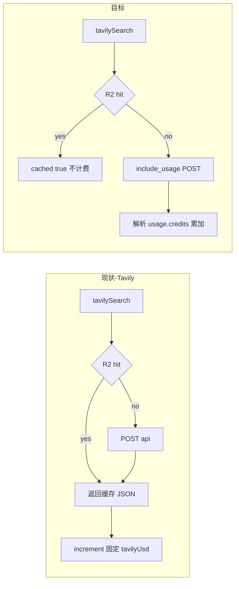

# 调用后解析厂商计费字段并驱动配额

## 现状摘要

| 厂商 | 代码现状 |
|------|----------|
| **OpenRouter** | [`resolveOpenRouterChargeUsd`](src/utilities/aiCostPricing.ts) 已优先用 `usage.cost`；[`recordOpenRouterAiCost`](src/utilities/aiCostLog.ts) 入账文档 |
| **Together** | [`togetherImageGenerateBytes`](src/services/integrations/together/hidream.ts) 已附带 `raw`；[`resolveTogetherImageChargeUsd`](src/utilities/aiCostPricing.ts) 递归解析 `cost` 等键；但各配图路由仍 [`incrementSiteQuotaUsage(..., { imagesUsd: 0.05 })`](src/app/api/pipeline/media-image-generate/route.ts) **固定估算** |
| **DataForSEO** | [`dataForSeoPost`](src/services/integrations/dataforseo/client.ts) 返回 JSON；各路由成功后 **`incrementSiteQuotaUsage(..., { dfs: N })` 整数估算**，与 API [`tasks[].cost`](https://docs.dataforseo.com/v3/)（美金）不一致 |
| **Tavily** | [`tavilySearch`](src/services/integrations/tavily/client.ts) 未传 **`include_usage: true`**；[`runBriefGeneration`](src/app/api/pipeline/brief-generate/runBriefGeneration.ts) 等用固定 **`tavilyUsd`**；且 **R2 缓存命中仍会调用 increment**，与「未调用 Tavily」不符 |

你已选定：**DataForSEO 以 API 美金为准，替换原有 dfs 点数累计口径**（配额字段语义切换需在迁移里交代）。

## 1. 解析工具（新建小模块）

建议在 [`src/services/integrations/dataforseo/`](src/services/integrations/dataforseo/) 旁新增 `extractDataForSeoCostUsd.ts`（或 `billing.ts`）：

- 输入：`unknown` JSON（标准信封包含 `tasks?: Array<{ cost?: number; ... }>`）。
- 输出：`sum(Number(task.cost))`（仅统计有限正数）；若解析不到有效 cost，返回 `0` 并在调用方打日志（可选 `payload.logger`），避免静默漏记。
- 单元测试：fixtures 覆盖单 task、多 task、`tasks` 缺失。

在 [`src/services/integrations/tavily/client.ts`](src/services/integrations/tavily/client.ts)：

- 请求体增加 **`include_usage: true`**（与 [Tavily Search API](https://docs.tavily.com/documentation/api-reference/endpoint/search) 一致）。
- **返回值改为带元数据**（二选一，避免大面积静默踩坑）：
  - **推荐**：`{ body: unknown; cacheHit: boolean }`，所有调用方解构 `body`。
  - 或新增 `tavilySearchWithMeta` 保留旧签名（遗留更少改动）。
- 新增 `extractTavilyUsageCredits(body: unknown): number | null`：读取 `usage.credits`（无则 `null`）。

## 2. 站点配额：`dfs` → API 美金累计

文件：[`src/utilities/siteQuotaCheck.ts`](src/utilities/siteQuotaCheck.ts)、[`src/collections/SiteQuotas.ts`](src/collections/SiteQuotas.ts)、[`src/payload-types.ts`](src/payload-types.ts)（`pnpm run generate:types`）。

- **`UsageYtdShape`**：用 **`dataForSeoUsd`**（或保留键名 `dfs` 但文档写明其为美金——不推荐易混）替代写入路径；**停止向 `dfs` 累加整数**。
- **`incrementSiteQuotaUsage`**：接收 `dataForSeoUsd` delta；合并时对旧数据可做一次性读取兼容（若仍存在 `dfs` 可读入迁移）。
- **`checkPipelineSpendForJob`**：把 [`EST_DFS_UNITS`](src/utilities/siteQuotaCheck.ts) 改为 **`EST_DATAFORSEO_USD`**（各 `jobType` 的上限预估，用于「发起请求前」拦截）；比较 **`spent dataForSeoUsd + estUsd`** 与 **`monthlyDfsCreditBudget`**。
- **Admin 文案**：[`SiteQuotas`](src/collections/SiteQuotas.ts) 中 `monthlyDfsCreditBudget` 的说明改为 **「月度 DataForSEO 支出上限（USD，与 API tasks[].cost 合计对齐）」**；`usageYtd` 描述区分 `dataForSeoUsd` / `tavilyCredits`（见下）等。

### 迁移（D1）

新增 Payload migration：

- 将现有 `usage_ytd` JSON 中 **`dfs` 旧整数**迁移为 **`dataForSeoUsd`**：`dataForSeoUsd = (dfs ?? 0) * LEGACY_DFS_UNIT_USD`，`LEGACY_DFS_UNIT_USD` 取保守常数（例如 **0.02**，并在 migration 注释中写明「仅为近似，上线后请人工核对配额」）；删除或清空 `dfs` 键。
- 将 **`monthly_dfs_credit_budget`**：`newUsdCap = old * LEGACY_DFS_UNIT_USD`（同上常数），避免旧「约 100 点」直接变成「100 USD」失控。**迁移后需在 Admin 抽查几家站点配额。**

## 3. 逐调用点接线（DataForSEO）

对每个 **`dataForSeoPost` 成功返回** 且能解析到 **siteId** 的路径：

| 区域 | 动作 |
|------|------|
| [`keyword-discover/route.ts`](src/app/api/pipeline/keyword-discover/route.ts) | 对 `dfs` 响应 envelope 调 `extractDataForSeoCostUsd`，`incrementSiteQuotaUsage(..., { dataForSeoUsd })`；修正当前类型假定（应为信封而非数组） |
| [`rank-track/route.ts`](src/app/api/pipeline/rank-track/route.ts)、[`brief-generate/runBriefGeneration.ts`](src/app/api/pipeline/brief-generate/runBriefGeneration.ts)、[`serp-audit/route.ts`](src/app/api/pipeline/serp-audit/route.ts)、[`amazon-sync/route.ts`](src/app/api/pipeline/amazon-sync/route.ts)、[`backlink-scan/route.ts`](src/app/api/pipeline/backlink-scan/route.ts) | 成功后解析 cost 并累加（若尚无 increment，则 **新增**；需绑定站点上下文） |
| [`merchant-slot-fetch/route.ts`](src/app/(payload)/api/admin/offers/merchant-slot-fetch/route.ts) | 若有站点/租户语义，补记账 |
| [`dfs-fetch/route.ts`](src/app/(payload)/api/admin/keywords/dfs-fetch/route.ts) | 预检由「整数点数」改为 **`spentUsd + estimatedBatchUsd`**；记账改为 **`fetchKeywordSuggestionsLive` 循环内每次 POST 的 cost 之和**——需扩展 [`fetchKeywordSuggestionsLive`](src/services/integrations/dataforseo/keywords.ts) 返回 **`totalCostUsd`**（或在函数内累加并透出） |
| [`keywordClusterPipeline.ts`](src/utilities/keywordClusterPipeline.ts) | 若有站点 ID，应在 POST 成功后同样 **`incrementSiteQuotaUsage`**（当前缺口，建议在实施时一并补上或通过上层 workflow 传入 siteId） |

预检（如 dfs-fetch 内手写配额判断）：改为使用 **`findSiteQuotaForSite` → usageYtd.dataForSeoUsd** 与 **`monthlyDfsCreditBudget`（美金语义）**。

## 4. Tavily：解析 credits + 缓存不计费

- 所有 **`tavilySearch`** 调用方（[`runBriefGeneration`](src/app/api/pipeline/brief-generate/runBriefGeneration.ts)、[`draft-section/route.ts`](src/app/api/pipeline/draft-section/route.ts)、[`runDraftFinalize`](src/app/api/pipeline/draft-finalize/runDraftFinalize.ts) 等）改为只在 **`cacheHit === false`** 且 **`usage.credits` 存在** 时 **`incrementSiteQuotaUsage`**。
- **`UsageYtdShape`** 增加 **`tavilyCredits`**（整数累计）；若仍需美金视图，可用 **`tavilyCredits * env.TAVILY_USD_PER_CREDIT`**（默认 **0.008** 与文档 PAYG 对齐）写入 **`tavilyUsd`** 或仅保留 credits。
- **可选**：新增 `monthlyTavilyCreditsBudget` 字段并在 **`checkPipelineSpendForJob`** 中拦截（当前未拦截 Tavily；若不做字段，可 Phase 2）。

## 5. Together 配图与 `imagesUsd`

- 在 hero / logo / category cover / media-image 等路由中：**用 `resolveTogetherImageChargeUsd({ raw }).usd` 替代固定 `0.05`** 调用 `incrementSiteQuotaUsage(..., { imagesUsd })`（或改名为 `togetherImageUsd` 更清晰——若改动字段需 migration；最小改动是继续用 `imagesUsd` 键但值为解析结果）。
- **`togetherImageGenerate`**（仅 URL、无 `raw`）若仍在用：需扩展返回 `raw` 再解析，否则保留兜底。

## 6. 测试与验收

- **单元测试**：`extractDataForSeoCostUsd`、`extractTavilyUsageCredits`、Tavily `cacheHit` 分支行为。
- **回归**：跑现有 [`tests/unit/aiCostPricing.spec.ts`](tests/unit/aiCostPricing.spec.ts) 相关；为 dfs-fetch / keywords live mock **带 cost** 的 envelope。
- **人工**：部署后核对 Admin「站点配额」中 **DataForSEO 月度上限** 是否被迁移到合理美金区间。

## 风险与边界

- **历史 JSON**：`usageYtd` 里混合旧 `dfs` 与新 `dataForSeoUsd` 时，迁移脚本必须幂等。
- **无 siteId 的管理员工具**：若某些 DFS 调用无法归因站点，只能记录日志或跳过配额（需在计划中明确取舍）。
- **keyword-discover** 当前对响应形态的 TS 假定可能与真实信封不一致；解析 cost 时顺便统一为信封模型。
