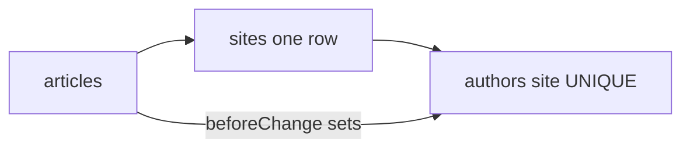

# 每站点单一作者 + 文章自动归类

## 产品假设（已定）

- 每个站点对应**一个**编辑部作者人设（实体上一条 `authors` 文档）。
- 某站点下的文章**不需要**手选作者：`author` 始终对应该站点的那条作者记录。

## 数据模型（较上一版 plan 的简化）

不再采用「`authors.sites` 多选 + 文章 relationship filterOptions」为主路径。

1. **`authors` 增加必填 `site`**，类型 `relationship` → `sites`，**最大基数 1 对 1**：数据库层对 `site_id`（或 Payload 等价列）做 **UNIQUE**，保证「一站最多一个作者」。
2. 不在 `sites` 上再挂重复的 `author` 指针（除非你们希望站点编辑页一键跳转——可选 `Sites` 只读 `join` 或 admin 自定义，避免双源事实；**单一事实源**为 `authors.site`）。

若更希望在「站点」文档里点选作者：可改为 **`sites.defaultAuthor` + `authors.site` 双字段**，再用 `beforeChange` 同步一致——复杂度高，**默认不推荐**。

## 文章写入逻辑

- 新增 hook（例如 `articleSyncAuthorFromSite`），挂到 [`Articles`](src/collections/Articles.ts) 的 `beforeChange`（建议在 `articlePublishGate` 之前，以便发布闸总能看到 `author`）：
  - 从 `data.site`（或 `originalDoc.site`）解析 `siteId`。
  - `payload.find` `authors`，`where: { site: { equals: siteId } }`，`limit: 1`。
  - 将 `data.author` 设为该文档 `id`（若 `data.site` 变更则覆盖旧 author）。
- **边界**：若站点尚无作者，保存/发布应 **明确报错**（与现有 [`articlePublishGate`](src/collections/hooks/articlePublishGate.ts) 「发布需 author」一致），提示先在「作者」为该站点创建一条记录。

## Admin UX

- [`articleSeoFields`](src/collections/shared/articleSeoFields.ts) 中的 `author`：`admin.readOnly: true` 或 `admin.hidden: true`，并加说明文案：**由当前文章的站点自动填充**。
- **`reviewedBy`**：未在本次需求中取消，可继续手选（若需按站过滤，可再加 `filterOptions`，作为后续小迭代）。

## 迁移与回填

- Migration：给 `authors` 表加 `site_id`（及 NOT NULL / UNIQUE，按你们 SQLite 实际列名）。
- 已有数据：需一次性策略——为每个已有 `sites` 行创建默认 Author，或对历史文章按 `site` 批量设 `author`（脚本或 SQL）。

## 可选后续（本 plan 不强制）

- `authors.slug` 全局 unique 与「一站一人」并存时，可保留全局 slug 或用 `site-slug` 组合；冲突时再收紧为复合唯一。

## 验收

- 新建文章：选好 `site` 后无需选 `author`，保存后 `author` 自动为该行站点作者。
- 同一 `site` 下无法创建第二条「未换站」的 author（DB 拒绝或 hook 拒绝）。
- 发布仍满足 EEAT：**始终有** `author`（来自站点）。

