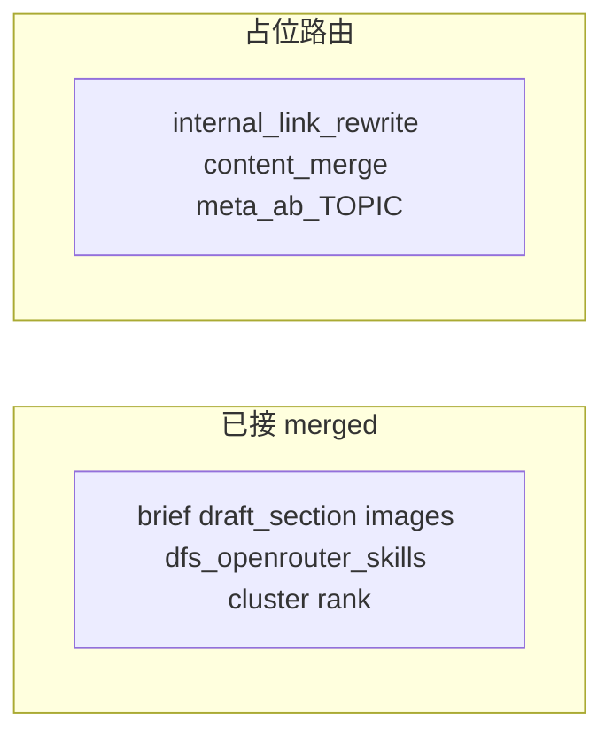

# 流水线字段接线状态清单（PipelineSettingShape）

[`mergePipelineProfileOntoGlobal`](src/utilities/pipelineSettingShape.ts) 合并 profile 到全局 [`normalizeGlobalPipelineDoc`](src/utilities/pipelineSettingShape.ts)。解析入口：[`resolvePipelineConfig`](src/utilities/resolvePipelineConfig.ts)；HTTP 侧快捷合并：[`resolveMergedForPipelineRoute`](src/utilities/resolvePipelineConfig.ts)（article → site → tenant → 仅全局）。

## 已接线（运行时读取 `merged` 或派生）

| 字段 | 使用方式 |
|------|----------|
| `tavilyEnabled` | [`brief-generate`](src/app/api/pipeline/brief-generate/route.ts) |
| `dataForSeoEnabled` | brief-generate、[`dfs-fetch`](src/app/(payload)/api/admin/keywords/dfs-fetch/route.ts)、[`backlink-scan`](src/app/api/pipeline/backlink-scan/route.ts)、[`amazon-sync`](src/app/api/pipeline/amazon-sync/route.ts)、[`serp-audit`](src/app/api/pipeline/serp-audit/route.ts)、[`keyword-discover`](src/app/api/pipeline/keyword-discover/route.ts)、[`rank-track`](src/app/api/pipeline/rank-track/route.ts)、[`keyword-cluster`](src/app/api/pipeline/keyword-cluster/route.ts)（经 [`runKeywordClusterForSite`](src/utilities/keywordClusterPipeline.ts)） |
| `togetherImageEnabled` / `defaultImageModel` | [`media-image-generate`](src/app/api/pipeline/media-image-generate/route.ts)、[`site-logo`](src/app/api/pipeline/site-logo-generate/route.ts)、[`site-hero-banner`](src/app/api/pipeline/site-hero-banner-generate/route.ts)、[`category-cover`](src/app/api/pipeline/category-cover-generate/route.ts)、[`image-generate`](src/app/api/pipeline/image-generate/route.ts) |
| `defaultLlmModel` / `llmModelsBySection` | [`selectLlmModelForSection`](src/utilities/pipelineSettingShape.ts)、brief-generate、draft-section、[`pickPipelineOpenRouterModel`](src/utilities/pipelineSettingShape.ts)（[`domain-audit`](src/app/api/pipeline/domain-audit/route.ts)、[`competitor-gap`](src/app/api/pipeline/competitor-gap/route.ts)、[`alert-eval`](src/app/api/pipeline/alert-eval/route.ts)）、[`generate-review-mdx`](src/app/(payload)/api/admin/offers/generate-review-mdx/route.ts) |
| `frugalMode` | brief-generate（Tavily 深度、跳过 DFS、`gpt-4o-mini`）；`pickPipelineOpenRouterModel`（抠门时强制 mini） |
| `sectionParallelism` / `sectionParallelWhitelist` | [`canEnqueueDraftSection`](src/utilities/pipelineSettingShape.ts)、[`enqueueAvailableDraftSectionJobs`](src/app/api/pipeline/lib/articlePipelineChain.ts) |
| `sectionMaxRetry` | [`draft-section`](src/app/api/pipeline/draft-section/route.ts) |
| `eeatWeights` | draft-section → [`pickEeatWeightsForContentType`](src/utilities/pipelineSettingShape.ts) |
| `amzKeywordEligibility` | [`loadAmzEligibilityThresholdsFromMerged`](src/utilities/keywordEligibility.ts) + dfs-fetch |
| `defaultLocale` / `defaultRegion` / `amazonMarketplace` | [`resolveDfsLocationLanguageFromMerged`](src/utilities/pipelineDfsLocale.ts)；brief-generate、dfs-fetch、serp-audit、keyword-discover、rank-track、keyword 聚类（loc 与 SERP 请求） |

## 仍多为占位、未调 LLM/DFS 的 pipeline 路由

如 [`internal-link-rewrite`](src/app/api/pipeline/internal-link-rewrite/route.ts)、[`content-merge`](src/app/api/pipeline/content-merge/route.ts)、[`meta-ab-*`](src/app/api/pipeline/meta-ab-pick/route.ts) 等仍为占位逻辑；待实现真实 OpenRouter/DataForSEO 时再挂 `resolveMergedForPipelineRoute` 即可。

## 维护提示

新增会扣费或选模型的 `/api/pipeline/*` 时：优先 `resolveMergedForPipelineRoute` + 读 `dataForSeoEnabled` / `togetherImageEnabled` / `pickPipelineOpenRouterModel`（或 `selectLlmModelForSection`），与 Admin [`dfs-fetch`](src/app/(payload)/api/admin/keywords/dfs-fetch/route.ts) 行为对齐。
