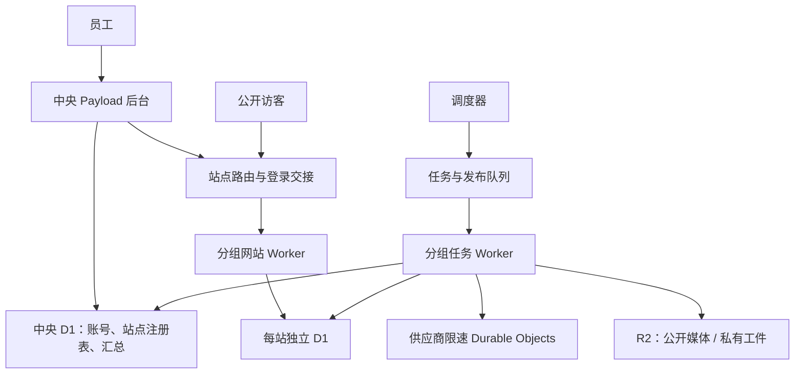

# payload-wnam：一站一 D1 完整执行方案

更新日期：2026-09-16。状态：实施方案，尚未表示完成代码改造、迁移或容量验收。

## 1. 目标与已确定的选择

采用“中央管理后台 + 每个网站一个 D1 + 多站点共享分组 Worker”的架构。数据库按网站划分，员工通过权限管理网站；员工调岗不需要搬迁数据库。

| 项目 | 规划 |
| --- | --- |
| 员工 | 20 人 |
| 每人管理网站 | 10–50 个 |
| 网站总数 | 200–1,000 个 |
| 每站产量 | 每天 10 篇，全天 24 小时分散生产 |
| 全平台产量 | 每天 2,000–10,000 篇，每年 73 万–365 万篇 |
| 内容流程 | 研究、提纲、分段正文、配图、质量检查、自动排期发布 |
| 后台方式 | 统一登录，选择网站进入该站编辑后台 |
| 访客成本基线 | 每站每天 1,000 PV；实际缓存率和请求数另行测量 |
| 迁移方式 | 允许单站短暂冻结写入与任务 |
| 技术基础 | 保留 Payload、Next.js、Workers、D1、R2 |

首轮固定现有依赖版本，避免将框架升级与分库改造混在一起。每天 10 篇是容量和调度目标，受模型供应商额度、选题储备及质量审核约束；不得为了凑数降低质量门槛。

本项目 GitHub 使用用户明确保留的 `Begin-Source/payload-wnam`，作为既有 AgentOS 账号规则的项目例外。Cloudflare 使用“基源科技”，账户 ID 为 `d487cf34c606620b442632a72272014d`。其他仓库的归属不因此改变。远程写操作前仍须阅读 `../../agentos-deployment/PROJECT_ACCOUNTS.md` 并核验目标资源。

## 2. 构建与上线规则：安装、测试、构建和部署均在 Cloudflare

**按用户最新要求，所有依赖安装、测试、构建和部署均在 Cloudflare Builds 中执行。本地修改代码后，按已授权范围推送到关联 GitHub 仓库，由 Cloudflare 构建；构建成功并通过检查，才部署新版本。构建失败不部署新 Worker，现有线上版本继续服务。**

执行链路：

```text
修改代码 → 本地差异检查/静态语法检查
         → 推送到关联 GitHub 仓库的部署分支
         → Cloudflare Builds：按锁文件安装依赖 → pnpm run ci:build
         → 检查成功、生成与本次提交匹配的 release marker
         → Cloudflare Builds：pnpm run ci:deploy
         → 线上 smoke 与监控
```

- 不在本地运行 `pnpm build`、`pnpm preview`、`pnpm ci:build`、`next build`、`opennextjs-cloudflare build` 或其他生成部署产物的等价命令。
- 不在本地执行部署命令绕过 Cloudflare Builds，不伪造 `CI` 环境或 release marker，不跳过失败检查强行上线。
- 云端构建失败由执行代理主动跟进：读取对应提交的 Cloudflare 日志、定位原因、修改代码或配置、重新推送并观察结果，持续到构建、部署与线上检查通过。不能只报告失败或触发重试就结束，也不转为本地构建来规避失败。已授权发布范围内的常规修复与再次推送，无须用户逐次确认。
- 不在本地安装依赖或运行测试；本地仅进行源码阅读/修改、差异检查和静态语法检查。单元/集成测试、完整构建、浏览器测试与发布检查均在云端执行。文档修改本身不需要应用构建或生产部署。
- 本文记录执行方式，不代表已执行提交、推送、上线或数据库迁移。后续操作遵循用户已有授权。

### 现有脚本提供的保护及边界

`scripts/ci-build.mjs` 清理旧 marker，在隔离的 CI 配置下依次执行 `ci:check`、OpenNext 构建、Playwright 检查，全部成功才写入提交标记。

`scripts/ci-deploy.mjs` 核对提交标记、构建产物、CI 环境和账户资源，记录原部署信息，然后依次执行 D1 恢复信息检查、数据库迁移、Worker 部署及线上 smoke。

因此，“构建失败不上线”可以作为发布门禁；**“部署后 smoke 失败自动恢复旧版本”目前并未实现。** 数据库迁移也可能先于 Worker 部署产生影响。实施时必须使用向后兼容迁移，并提供显式回滚操作；不能把所有部署阶段失败都等同于生产完全没有变化。多组 Worker 发布也不是跨所有服务的原子事务，必须按批次记录成功版本。

## 3. 架构与分组



- 初始每组最多 50 个网站，使用一个网站 Worker 和一个任务 Worker；上线压测后可以降低组大小。
- 1,000 站约 20 组、40 个站点服务 Worker，另有中央后台、路由和调度服务。
- Worker 分组与员工归属无关。相同角色使用同一代码产物，以分组清单配置 D1 bindings 和站点映射。
- 日常数据库访问使用原生 D1 bindings。建库、迁移和绑定变更由受限运维流程执行，浏览器和普通内容任务不得持有账户管理令牌。
- 上线前核实当时的账户数据库配额、Worker 数量、bindings 数量、包大小及 CPU/内存限制。组大小是规划值，不是已经通过验证的容量结论。

## 4. 数据边界与 Payload 隔离

| 位置 | 保存的数据 |
| --- | --- |
| 中央 D1 | 用户、团队、角色、员工站点权限、站点域名与分组注册表、财务导入和佣金、公司知识库、公共提示词/模板/作者/商品主数据、站点汇总 |
| 站点 D1 | 文章、页面、分类、关键词、brief、排名、重定向、生产任务、质量记录、用量、发布日历，以及供站内关联使用的作者/商品/配置版本副本 |
| 公开 R2 | 允许公开访问的图片等媒体 |
| 私有 R2 | 研究原始资料、大型任务输入输出、归档和备份；不得与公开桶共用访问策略 |

共享资料按版本同步。更新公共模板或商品主数据时，不自动覆盖员工已经审定的站点内容、分类和展示位置。

### 标识与关系

- 中央 `siteId` 永久稳定。迁移保留站内原记录 ID、时间戳、状态和 URL。
- 跨库引用采用 `{ siteId, collection, recordId }`，不能只记录 `articleId`。
- 新媒体使用 `sites/<siteId>/...` 路径；迁移保留旧媒体 URL 的兼容访问。
- 不使用跨数据库外键或跨库事务，以事件、幂等写入和对账维护一致性。
- 站点注册表增加 `databaseId`、`bindingName`、`workerGroup`、`schemaVersion`、`routingVersion`、`migrationState`、`timezone`、`productionEnabled`。

### Payload 运行方式与先行验证门槛

中央和站点使用独立 Payload 配置与服务边界。站点 Worker 的一个 isolate 内复用站点 Payload 实例，通过不可变请求上下文选择当前 D1；不缓存成百上千个 Payload 实例。

这是需要验证的定制适配方案，不能假设 Payload 原生支持按请求任意切换数据库：

1. 使用 AsyncLocalStorage 传递 `{ siteId, binding, identity, routingVersion }`。
2. D1 adapter 的上下文代理将每次查询与 batch 严格绑定到该请求的数据库。
3. 缺少上下文、路由版本失效、跨站 batch 一律拒绝；不回退到全局默认数据库。
4. 移除当前可变的全局 D1 binding 回退，覆盖原始 SQL、nonce、租约、队列、流式响应和异步回调路径。
5. 所有站点相关缓存包含站点及配置版本；审计 Payload 内部缓存与 adapter 初始化行为。
6. 启动期查询、自动 seed 和迁移移到显式建站流程；首版关闭读副本，降低一致性复杂度。
7. 在 Cloudflare 云端测试环境以真实 workerd/D1 路径验证，并检查内存、冷启动和 CPU。

如果请求隔离无法可靠通过，P0 阶段停止推广，记录失败原因后调整方案，不通过放松权限或全局 binding 回退绕过问题。

参考：[Cloudflare AsyncLocalStorage](https://developers.cloudflare.com/workers/runtime-apis/nodejs/asynclocalstorage/)。

## 5. 统一登录与站点后台

- `agenthub.beginos.org` 为正式中央管理入口，显示员工有权限的网站和汇总；`hub.beginos.org` 仅作为迁移期兼容入口并重定向到正式域名。
- 选择站点后进入 `cms-site-<siteId>.beginos.org`，通过路由保留站点 Payload 的 `/admin` 和 API 路径。
- 中央签发有效期 60 秒、只能兑换一次且绑定目标站点的登录票据。
- 站点使用 host-only Cookie，后台会话不扩散到公开网站域名。
- 使用站点 Payload 自定义认证策略，不复制密码，也不开放站点独立密码登录。
- 每次后台请求验证中央会话和最新站点权限；撤销权限立即生效。中央认证不可用时拒绝后台写入，公开缓存读取保持独立。
- 不信任客户端自行传入的站点头、角色或数据库名称。
- 首版以单站编辑为主；跨站运营看中央汇总，不做混合站点内容编辑。

中央提供建站、进入站点、暂停/恢复、迁移状态和汇总接口。站点内容 API 保持现有语义，但始终受站点上下文约束。MCP 和外部自动化必须指定 `siteId` 并验证权限；目标不明确时返回错误，不自动猜测网站。

参考：[Payload 自定义认证策略](https://payloadcms.com/docs/authentication/custom-strategies)。

## 6. 自动生产：队列、限速和一致性

### 任务拆分与公平调度

将长时间运行的站点循环改为持久化步骤链。每日为各站安排 10 个生产/发布目标，检查关键词和 brief 储备后按站点轮转调度，避免少数网站占满资源。

一个队列消息只执行一个有界步骤，例如研究、brief、单段正文、整稿整理、配图或质量检查；保存成功后触发下一步。发布使用独立队列。消息保存 `siteId`、`jobId`、`stepKey`、`routingVersion`、`schemaVersion`，大型内容仅传私有 R2 引用。

| 限制 | 初始值与提升方式 |
| --- | --- |
| 每组生产任务并发 | 从 2 开始，经验证提升到 4、8 |
| 每组发布并发 | 从 1 开始，经验证提升到 2 |
| 每站生产 | 同时最多 1 篇活跃文章 |
| 同一篇文章正文写入 | 串行，带修订版本检查 |
| 单步骤超时 | 240 秒，部署时校验对应运行时限制 |

200 站在每组 50 站时为 4 组，最高规划 32 个生产并发槽位；1,000 站为 20 组、160 个槽位。是否足以完成日目标取决于每篇总步骤耗时、重试及供应商额度，必须以试运行验证。

### 供应商配额

按供应商账户、模型分别控制文本、搜索、图片的请求数、token 和并发。使用 SQLite Durable Objects 管理令牌桶和并发许可，AI 请求在任务 Worker 执行，不在协调器内等待完成。

读取实际供应商额度并保留现有用量预算。尚未配置额度的通道暂停生产；遇到 429 按供应商返回与指数退避恢复，不能无限提高 Workers 并发。

### 幂等、租约与重试

- Queues 按至少一次投递设计，重复消息是正常情况。
- 任务使用确定性的步骤键、原子领取、180 秒租约和每 30 秒心跳。240 秒的步骤必须续租；失去租约的执行器不得提交结果。
- 正文写入检查修订版本，避免覆盖员工期间的手工编辑。
- 同库状态更新、去重记录、Outbox 以适当的原子条件更新/事务性 batch 提交；不得把先查询再普通更新当作锁。
- Outbox 定期补发未投递事件，处理“数据已提交、下一步消息没发出”的中断。
- 网络、429 和可重试服务端错误采用指数退避加抖动；每步骤最多 5 次总尝试，避免多层重试相乘。
- 外部请求结果不明且供应商不支持幂等时进入核查状态，不能承诺绝无重复外部计费。
- 超过重试次数进入死信队列，后台显示失败原因和受控重试入口。

参考：[Queues 投递保证](https://developers.cloudflare.com/queues/reference/delivery-guarantees/)。

## 7. 自动排期、公开访问与汇总

### 发布规则

- 站点默认 UTC，可设置 IANA 时区；每日额度按站点当地日期计算。
- 当前默认 `dailyPostCap` 从 3 调整到 10，并允许按站点配置。
- 新站先建立合格稿件库存，再进入稳定生产；一天设置 10 个分散的发布时间槽。
- 稿件未准备好时推迟到后续可用时间槽，不重复发布，不突破日上限。
- 使用唯一时间槽和原子状态转换，阻止重复任务造成重复文章或重复发布。
- 发布时重新验证当前内容版本：质量分数至少 80、无硬性否决项、作者与联盟披露完整、必要商品关联齐全、正文完整、至少有封面图。
- 手工修改后使相关旧审核结果失效。质量不达标时记录产量缺口，不能直接放行。

### 缓存与媒体

先解析可信站点映射，再按域名、语言、路径及必要查询参数构造缓存键。公开 HTML 初始缓存 300 秒；后台、预览、认证响应和未发布内容不进入公开共享缓存。

发布或撤稿清理相关文章、列表等 URL 缓存；清理失败以明确 TTL 作为陈旧上限。图片使用公开 R2 和带版本的文件名，不让每次图片访问都经过 Payload。

95% 缓存命中率是目标，不是现状；容量和成本分别用 80%、95%、99% 场景评估。缓存命中是否仍调用 Worker 取决于最终路由/CDN 配置，不能把 HTML 命中率直接等同于 Workers 计费请求减少比例。

### 中央汇总

有变化的站点最多每 5 分钟提交一次汇总：生成数、发布数、待处理、失败、供应商费用和更新时间。汇总事件去重并按版本处理，每日对账。

中央仪表盘只读取中央汇总表，不在员工打开页面时扫描 1,000 个站点 D1。公开站点访问也不依赖中央后台实时查询文章。

### 留存和容量

- 已发布内容、必要审核依据、财务记录按业务要求保留。
- 大型任务输入输出在 D1 保留 30 天后转私有 R2，D1 保留状态、摘要、引用和去重依据。
- 普通请求日志初始采样 10%，错误日志完整保留但脱敏，不记录密码、Cookie 和密钥。
- 单 D1 到 7 GB 告警，8 GB 启动容量处置；账户累计 700 GB 告警，800 GB 启动额度/存储调整。
- 一站一库提高隔离和可拆分性，不代表单库写入并发无限，也不增加账户总免费额度。

## 8. 分阶段实施

| 阶段 | 工作 | 放行标准 |
| --- | --- | --- |
| P0：基线和可行性 | 测量现有 CPU、D1 读写/存储、供应商调用；用两个测试 D1 验证上下文切换、后台、上传、任务 | 真实运行时隔离成立，缓存不串站，资源占用可控 |
| P1：数据与身份 | 中央/站点配置、注册表、SSO、D1 上下文、共享副本、建站工具 | 新测试站全链路可用，权限撤销立即生效 |
| P2：生产执行 | 队列、站点公平调度、供应商限速、租约、Outbox、幂等、发布槽 | 故障注入后可恢复，不重复发布，不覆盖手工编辑 |
| P3：访问与运营 | 缓存、中央汇总、留存、监控、成本计量 | 无公开数据泄露、无仪表盘跨库扫描、指标可观测 |
| P4：单站迁移 | 选择小规模真实站迁移，连续观察 72 小时 | 内容和 URL 一致，真实生产质量、成本、耗时达标 |
| P5：分批扩大 | 5 → 50 → 200 → 1,000 站，每批至少稳定 48 小时 | 配额、容量和供应商吞吐经过验证，上一批问题关闭 |

P0 是硬门槛，后续不能先默认通过。每阶段实现和检查通过 Cloudflare Builds 执行，不在本地做生产构建。真实供应商验证与模拟负载验证分别报告。

### 运维命令

- `site:provision`：分配站点、创建 D1、初始化 schema、登记分组与绑定。[云端命令](site-per-d1-provision-command.md)已接通 `--request`、`--dry-run`、`--apply` 与六步恢复；[首次通用 D 站真实创建和单组普通发布](site-per-d1-p1-provision-d.md)已通过云端四站验收、上传中断恢复和完成后只读重入。[多请求历史解析与逐组发布协调](site-per-d1-fleet-management.md)已通过原生多组恢复测试及实际单组核验；[中央申请到 Queue/Cron/Deploy Hook、幂等执行及构建终态对账](site-per-d1-p1-dispatch.md)已通过六站真实云端验收。完整多组云端入口仍待完成，扩组后的历史站点改用独立只读核验。
- `site:migrate --dry-run`：只检查数据归属、关系和目标准备情况。
- `site:migrate --apply`：按单站冻结流程复制、核验和切换。
- `db:fleet-migrate`：按分组、schema 版本渐进迁移。
- `site:verify`：校验内容、关系、媒体、任务和路由。[云端只读命令](site-per-d1-site-verify.md)已接通当前分组清单、历史所有权凭证、实际 D1 绑定/路由、完整表库存与内容哈希、SQL 外键、R2 字节和显式任务站点引用；已通过云端四站各 81 表核验及源码摘要保护的原发布恢复。混合 schema、任意内嵌引用数据图和迁移源/目标比较仍待接通，不能据此放行 P4。
- `site:resume`：检查完成后恢复单站写入与生产。

除已接通的云端 `site:provision` 和上述范围的 `site:verify` 外，其余列出的命令仍是待开发接口，不应当作现有可执行命令。所有操作记录操作 ID、schema 版本和断点；只读核验目前安全重读全程，尚无持久分页断点；重复执行不得重复创建资源。初始运维并发 4，遵守 Cloudflare API 退避。

## 9. 单站迁移流程

1. 收集完整站点数据图，包括共享主数据副本、媒体、任务及排期。
2. 创建目标 D1 并应用目标 schema，预先准备分组部署配置。
3. 暂停该站人工写入、生产和发布；等待活跃租约结束。
4. 在冻结状态复制数据，保留原 ID、时间、发布状态和 URL。
5. 核验行数、关键内容哈希、关系、媒体、关键词、任务和发布时间槽。
6. 云端构建并部署所需分组 bindings，验证目标能够读取该库；耗时步骤尽可能在冻结前准备。
7. 在中央原子更新站点路由与 `routingVersion`，执行访问和权限 smoke。
8. 恢复写入与生产；旧消息按路由版本校验、重路由或去重。

冻结目标不超过 15 分钟。切换前若预计超时或校验失败，取消切换并恢复源站。最多同时冻结 5 站。发现归属不明或关联缺失时阻止该站迁移，不能静默丢弃记录。

### 回滚边界

- 恢复目标库写入前，可以切回仍完整的源库。
- 恢复写入后，新记录已进入目标库，不能直接切回陈旧源库。优先回滚兼容的应用版本；确需恢复数据库时先冻结并对账迁移后的增量。
- 旧库只读至少保留 30 天，不自动删除。
- 数据库恢复后核对中央汇总、缓存、Outbox、队列和发布状态，防止重放导致重复发布。

## 10. 云端发布与故障处理

上线前核验 GitHub 仓库身份、部署分支、Cloudflare 账户、各组 Worker、D1 和 R2 的资源 ID，不能仅凭当前 CLI 登录推断归属。

沿用现有 Cloudflare Builds，扩展部署清单，记录提交 SHA、各组代码版本、schema 版本、bindings、路由版本和可回滚应用版本。仅用新增表/字段等前后兼容迁移；删除旧字段等破坏性清理单独安排。

| 失败位置 | 行为 |
| --- | --- |
| 云端检查、构建或构建期浏览器测试失败 | 不生成有效发布标记，不执行新版本部署，修复后重新推送 |
| 账户、资源、提交标记等发布前检查失败 | 中止部署，核对配置，不绕过门禁 |
| 数据库迁移失败 | 中止后续部署，检查已执行迁移；依靠兼容性保护当前应用，按记录恢复 |
| 单组 Worker 部署失败 | 停止扩大批次，保留逐组结果，恢复或重试失败组 |
| 部署完成后线上 smoke 失败 | 暂停扩大范围，显式回滚兼容应用或按故障恢复流程处理；不能假设自动回滚 |

不得把失败的云端构建改为本地部署。每次修复继续使用相同云端链路，线上变更情况以 Cloudflare 实际部署记录为准。

执行代理负责完整闭环：跟踪提交 SHA 对应的云端构建和部署；失败时保留关键日志、修复原因并重新推送；成功后核验线上版本与 smoke 结果，再报告完成。若遇到缺少访问权限、外部服务故障等在现有授权内无法解决的阻塞，明确说明已尝试的处理、当前线上状态及需要的具体输入，不将失败或等待状态报告为完成。

## 11. 验收与测试

### 隔离与权限

两个 D1 使用相同记录 ID，并发验证 CRUD、batch、上传、队列、流式回调和缓存，确认不会跨站读写。覆盖伪造站点头、SSO 重放、撤销权限、缺少上下文、过期路由、预览与公开访问、MCP 目标错误。

### 任务与发布

覆盖重复消息、进程重启、租约失效、超时、429、Outbox 延迟/乱序和死信恢复。验证发布结果幂等、所有发布入口执行相同质量门槛、手工编辑不被覆盖、故障站不阻塞其他站。

### 迁移与恢复

覆盖共享引用、活跃任务、未来排期；校验迁移前后 URL、内容和媒体。演练切换前回退、切换后兼容应用回滚，以及单站数据库恢复后的对账。

### 容量验收目标

- 20 名员工同时进行常用列表和保存操作，服务端 P95 小于 2 秒，不计外部 AI 等待。
- 公开访问 120 请求/秒持续 1 小时，5xx 低于 0.1%，无持续资源耗尽；包含多个缓存命中场景。
- 可控供应商模拟环境中，1,000 站每天 10,000 篇持续 3 天，待处理积压不持续增长。
- 小批真实供应商连续试运行 72 小时，验证真实质量、费用、延迟和重试。模拟测试不能证明真实供应商额度足够。

使用现有 lint、类型检查、必要单元/集成/E2E 测试、文章质量 smoke，加上真实 workerd 隔离测试。**依赖安装、全部测试、构建和部署只在 Cloudflare Builds 执行。** 已通过的检查仅在相关修改、失败或未解决问题需要时重跑。

## 12. 监控、年度预算与交付

按站点记录日目标、生成/发布量、缺口、可执行队列最老等待时间、步骤耗时、失败率、重试/死信、CPU、D1 读写/容量、缓存、汇总延迟和供应商预算。

初始告警：可执行任务等待超过 30 分钟；15 分钟内失败率超过 2% 且样本至少 100；汇总延迟超过 15 分钟；预计无法达到当日产量；月预算预测达到 80%/100%。Cloudflare 费用告警不自动关闭公开站点，供应商预算限制优先控制新生产任务。

### 费用口径

Workers Paid 的每月 5 美元是基础订阅，不是项目总费用封顶。拆成更多 D1 不会让每库获得一份独立免费额度。Worker 请求、CPU、D1 读写与存储、R2、Queues、Durable Objects 等应按账户和各产品规则汇总。

沿用讨论中的暂定 Cloudflare 年度预算预留：200 站约 **1,500 美元/年**，1,000 站约 **10,000 美元/年**。这两个数是预算规划值，不是根据生产账单验证的报价，也不是承诺上限；不含 AI 文本/图片/搜索服务、域名、员工或第三方工具。访客基线为每站每天 1,000 PV，对应全平台每月约 600 万–3,000 万 PV（按 30 天），PV 不等于计费请求。

上线前用试运行更新估算，不只用文章篇数乘单价：

```text
年度 Cloudflare 费用
  = 12 × 基础订阅
  + 各月 Workers 请求与 CPU 超额费用
  + 各月 D1 读写与实际累计存储费用
  + 各月 R2 存储/操作、Queues、Durable Objects 等费用
```

记录每篇合格文章的平均及 P95 CPU、D1 行读写、队列操作、R2 增量和重试；测量访客每 PV 请求数与实际缓存路径。存储按逐月增长计算，纳入索引、版本、共享副本、归档及备份，不能把第一年末容量当成全年每月容量。

当前规划以 D1 单库 10 GB、付费账户总存储 1 TB 为约束；实施时按官方最新限制及实际账户获批额度核验。到达容量告警后优先检查数据留存和归档，再决定申请额度或调整架构。当前只有一个原始库，并不意味着可以未经配额检查直接创建 1,000 个生产库。

官方核验入口：[Workers 定价](https://developers.cloudflare.com/workers/platform/pricing/)、[D1 限制](https://developers.cloudflare.com/d1/platform/limits/)、[D1 定价](https://developers.cloudflare.com/d1/platform/pricing/)、[R2 定价](https://developers.cloudflare.com/r2/pricing/)、[Queues 定价](https://developers.cloudflare.com/queues/platform/pricing/)、[Durable Objects 定价](https://developers.cloudflare.com/durable-objects/platform/pricing/)。

最终交付包括：中央/站点配置与代码、数据库迁移、建站和批量运维工具、权限与数据关系说明、Cloudflare 构建部署清单、迁移校验报告、容量测试与真实试运行报告、按实测修订的年度成本表、员工操作说明和故障恢复手册。
